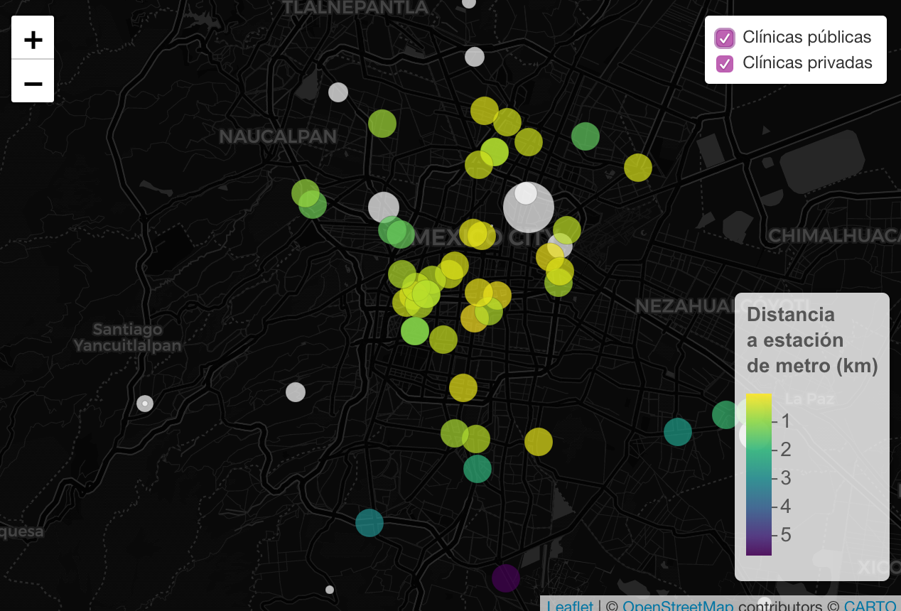
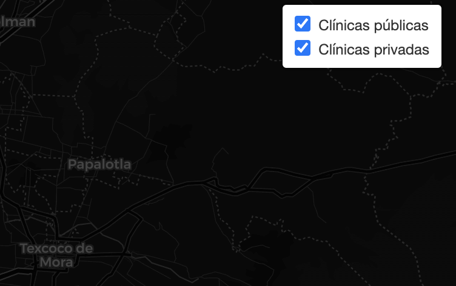
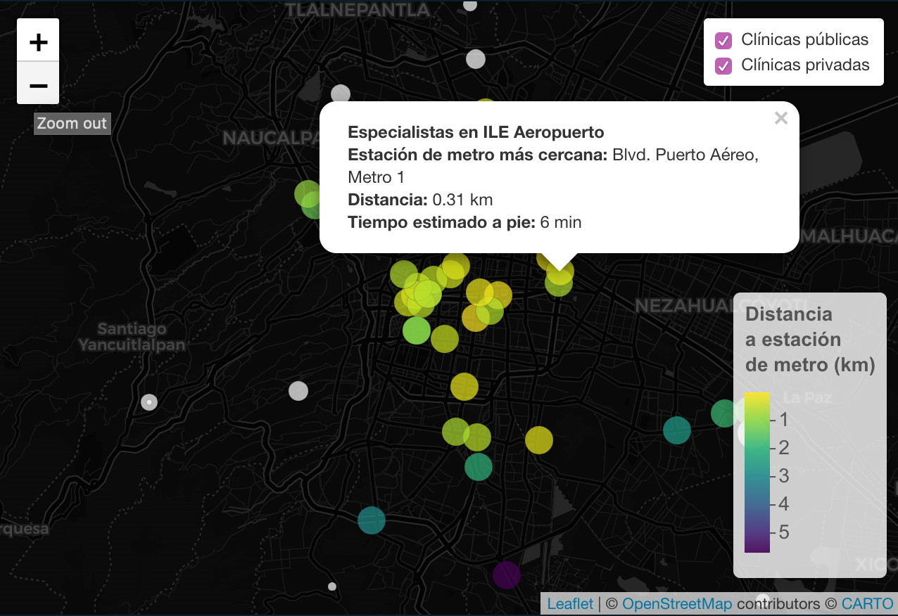
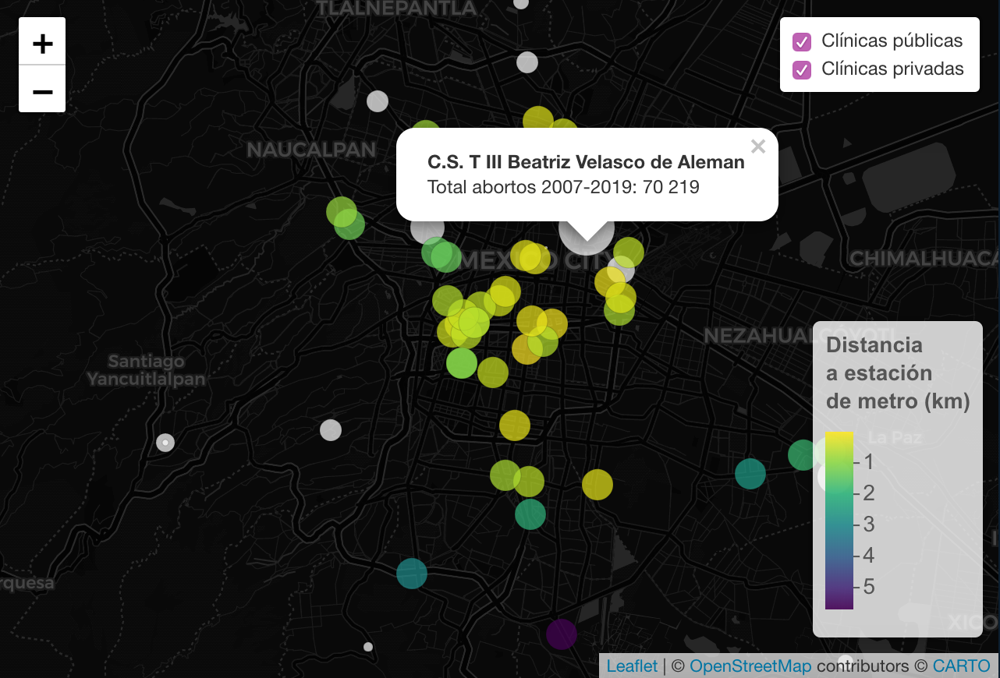

### Abortion clinics in Mexico City
*By Yuriria Avila*

The purpose of this project is to create a tool that women can use if they decide to have an abortion in Mexico City. 

I mapped 14 public clinics and 46 private clinics in Mexico City.

I created a filter for public and private clinics.

Public clinics are shown in white and private clinics are shown in a gradient color palette of yellow, green, or purple. The closer the clinics are to a metro station, the more yellow they will show, and the further, the more purple. 

 For the private clinics I added a tooltip to show the closest metro station and the approximate time it would take the user to get there by walking. 
 
 

For the public clinics, I added a tooltip with the number of abortions performed since 2007 when abortion was legalized. I’m assuming that the higher the number of abortions, the higher capacity of the hospitals to perform abortions.

 

**Here's the interactive map:** 

#### Abortion clinics and accesibility

<iframe src="clinicsfinal1.html" width= "100%" height="500" style="border:none;"> </iframe>

